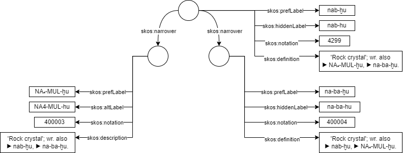

# Ebla Vocabulary

EblaVoc is a specialized [SKOS](https://en.wikipedia.org/wiki/Simple_Knowledge_Organization_System) vocabulary dedicated to the ancient Semitic language attested in texts from the ancient city of Ebla, modern-day Syria. This resource aims to provide a structured framework for cataloging and interpreting Eblaite lexical terms, facilitating research and analysis in the field of ancient Near Eastern studies.

## Transliteration conventions

The transliteration within EblaVoc adheres to specific conventions to ensure clarity and consistency in representing Eblaite terms:

1. **lower case** renders semitic reading of one or more signs (e.g. ba-ra-i).
2. **dash-separated upper case** renders Sumerian (e.g. ŠU-BA₄-TI).
3. **dot-separated upper case** renders sign names of uninterpreted words (e.g. AN.ŠE₃.GU₂).
4. determinatives are not marked by specific formatting (e.g. ʾa₃-da-um-TUG₂).
5. subscript numbers are rendered with unicode characters (*i.e.* ₃), full text search bypassing special characters is possible through `hiddenLabels` (see below).

## Structure and Usage

EblaVoc employs the following structure:

1. `skos:prefLabel` refers to the preferred lexical label, *i.e.*, the conventionally accepted transliteration of a term, such as bi₂-da-ʾa₃-tum for 𒉈𒁕𒂍𒌈.
2. `skos:altLabel` refers to other transliterations of the same term, *i.e.*, NE-da-ʾa₃-tum for bi₂-da-ʾa₃-tum. Different spellings (*i.e.*, different sequences of signs) referring to the same word are expressed as `skos:narrower` concepts (see below).
3. `skos:hiddenLabel` provides the same content as `skos:prefLabel` but with ASCII notation as per [ORACC standard](https://oracc.museum.upenn.edu/doc/search/searchingcorpora/index.html#h_searchingthetransliterations).
4. The semantic relation `skos:narrower` links different spellings of the same word: [GADA-TUG₂](https://erica-scarpa.github.io/eblavoc/purl.org/eblavoc/word77.html), which appears 601 times in the corpus, is considered the broader concept of other spellings such as [GADA](https://erica-scarpa.github.io/eblavoc/purl.org/eblavoc/word1923.html) (49 times) or [GIB₃.GARIG.TUR](https://erica-scarpa.github.io/eblavoc/purl.org/eblavoc/word400001.html) (appears only in TM.75.G.10142).

